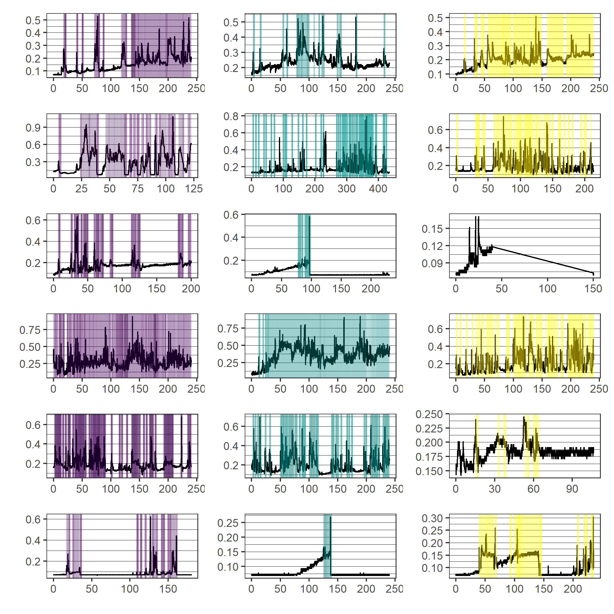
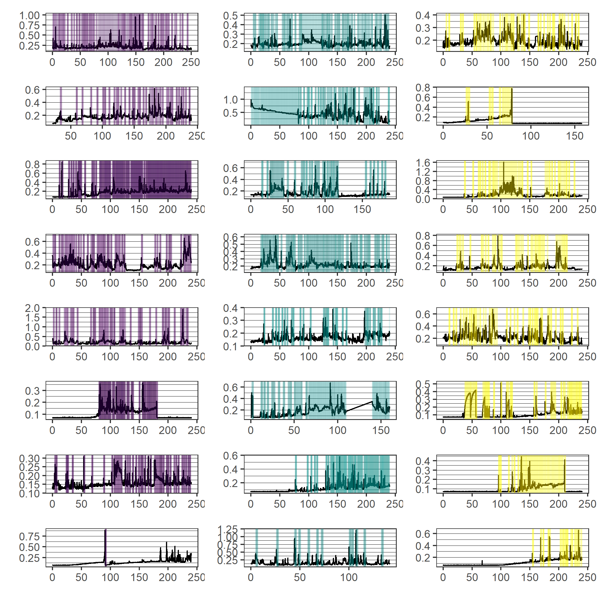
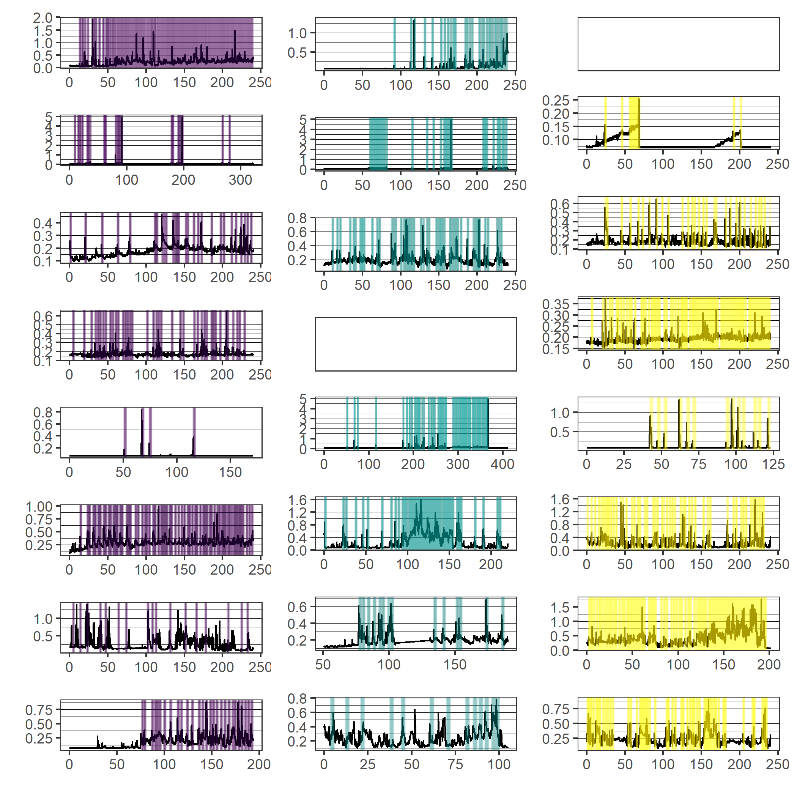

```{r setup, include=FALSE}
options(htmltools.dir.version = FALSE)
knitr::opts_chunk$set(
  fig.width=9, fig.height=3.5, fig.retina=3,
  fig.showtext = TRUE,
  out.width = "100%",
  cache = FALSE,
  echo = FALSE,
  message = FALSE, 
  warning = FALSE,
  hiline = TRUE
)
```

```{r xaringan-themer, include=FALSE, warning=FALSE}
# library(xaringanthemer)
# style_mono_accent(
#   base_color = "#1c5253",
#   header_font_google = google_font("Josefin Sans"),
#   text_font_google   = google_font("Montserrat", "300", "300i"),
#   code_font_google   = google_font("Fira Mono")
# )
```

```{r dados, include=FALSE}
library(magrittr)
```


## Sumário

### 1. [Introdução e Objetivos](#intro)
### 2. [Descrição do Estudo](#desc)
### 3. [Descrição das Variáveis](#variaveis)
### 4. [Análise Descritiva](#analise)
### 5. [Conclusões](#conclusoes)
### 6. [Próximos Passos](#proximos)


---
class: inverse center middle
name: intro
# Introdução

---
## Introdução

.left-column[
### Desenvolvimento infantil
<br><br><br><br>
### Premissa
]

.right-column[
>O desenvolvimento infantil e a plasticidade cerebral são maiores nos primeiros anos de vida. Sendo assim, quaisquer perturbações no ambiente ou no indivíduo impactam substancialmente na aquisição das habilidades motoras e cognitivas".  

<p style='text-align: right;'>-- Fundação Oswaldo Cruz</p>


 <br><br><br>
- Comportamento de bebês ao nascer é ativo (voluntário) e não reflexo (involuntário);
- Reflexos representam apenas uma pequena parte do comportamento motor inicial dos indivíduos;
- Os movimentos espontâneos (voluntários) parecem ser influenciados por restrições ambientais.

]

---
## Objetivos

.left-column[
### Geral<br><br><br>
### Pontuais
]

.right-column[
Investigar a emergência e desenvolvimento do comportamento voluntário das mãos 
em bebês de até três meses de idade, com base em alguns cenários experimentais.
<br><br><br>
Descrever o comportamento de apertar ao longo dos três primeiros meses após o nascimento.

Verificar se bebês de um a três meses são capazes de identificar a existência de um relacionamento entre o seu próprio comportamento de apertar e alterações no contexto ambiental.

Identificar se as relações do comportamento manual com os eventos ambientais se alteram ao longo de três sessões de prática na situação experimental.
]

---
class: inverse center middle
name: desc

# Descrição do estudo

---
## Sobre o experimento

.pull-left[
Os bebês foram colocados sentador em uma cadeira em frente a um monitor, em uma
posição estável. Um sensor de pressão foi posicionado na mão do bebê, para 
captar os apertos durante o experimento.

O estudo foi realizado de maneira presencial em três sessões individuais, dentro
de um período de 7 dias e consistiu em apresentar aos bebês **quatro condições 
experimentais**

Para cada condição, eram registrados os dados de pressão palmar relacionados aos
apertos que os bebês realizaram sobre o equipamento.
]

.pull-right[
<center></center>
<center></center>
]

---
## Sobre o experimento

.pull-left[
### Condições experimentais

- **Condição Basal**: sem nenhuma variação ambiental;
- **Contingente**: um vídeo aparecia se o bebê atingisse determinada pressão 
palmar (valor gatilho);
- **Não Contingente**: um vídeo aparecia de forma automática e aleatória, sem 
que o bebê atingisse o valor de pressão estipulado;
- **Condição Basal 2**: segunda condição sem estímulo visual
]

--
.pull-right[
### Gatilho para o disparo do vídeo 

- Correspondia à pressão exercida pelo bebê durante 70% do tempo de coleta na 
primeira tentativa Basal;
- O valor varia de criança para criança e se altera em cada dia de sessão;
- Caso o participante não tenha atingido a frequência de 70% em algum dos dias 
do experimento, foi estipulada a pressão gatilho de 0,2 mmHg.
]

---
## Sobre o experimento

### Participantes

- 21 bebês ao todo
- Pré-requisitos: 
  - nascimento entre 38 a 42 semanas de gestação sem nenhuma complicação médica no parto;
  - ser considerado saudável por seus médicos de acompanhamento;
  - estar na faixa etária de 1 a 3 meses de vida

### Limitações

- Interrupção de alguns processos de coleta de dados por causa da condição comportamental dos participantes; 
- Número pequeno de participantes no estudo e quantidade diferente de participantes em cada faixa etária;
- Processo de aleatorização das condições Contingente e Não ContiNgente


---
class: inverse center middle
name: variaveis

# Descrição das variáveis

---
## Descrição das variáveis

.pull-left[
### Variáveis originais

Para cada condição definida e dia do experimento, foram coletados os valores de 
pressão palmar realizada pelos participante ao longo do tempo.

- bebê
- vídeo (0 = sem vídeo e 1 = com vídeo)
- tempo (em milissegundos)
- pressão (em mmHg)
- dia (1, 2 ou 3)
- grupo (1, 2 ou 3 meses de idade)
- condição (c, nc, bas, pos)
]

--

.pull-right[
### Variáveis agrupadas

Calculadas pela pesquisadora através dos dados brutos do experimento. Após o 
tratamento das informações, obtivemos as seguintes variáveis:

- n_apertos: número de apertos na sessão
- freq_apertos (apertos/min)
- media_pressao (pressão média na sessão, em mmHg)
- sd_pressao (desvio padrão, em mmHg)
- pico: pressão máxima (mmHg)
- media_pressao_pico
- sd_pressao_pico 
- media_duracao_pico (em milissegundos)
- sd_duracao_pico (em milissegundos)
]

---
class: inverse center middle
name: analise

# Análise descritiva
---
class: middle
### Grupo

.pull-left[
```{r}
cea2::da_metadados %>% 
  dplyr::distinct(grupo, nome) %>% 
  dplyr::count(grupo) %>% 
  dplyr::mutate(grupo = dplyr::case_when(
    grupo == "b1" ~ "1 mês",
    grupo == "b2" ~ "2 meses",
    grupo == "b3" ~ "3 meses"
  )) %>% 
  dplyr::mutate(prop = formattable::percent(n/sum(n))) %>% 
  janitor::adorn_totals() %>% 
  knitr::kable(col.names = c("Grupo", "N", "%"))
```
]

.pull-right[
- A influência da idade na pressão exercida é um dos fatores de possível interesse na análise;
- Quantidade desbalanceada de bebês em cada categoria;
- Alguns participantes não possuem registros para determinadas condições.
]
---

.left-column[
### Pressão média

- Na condição Basal 1, percebe-se uma maior diferença na pressão média de acordo
com a idade do bebê;
- O comportamento da pressão média muda completamente no dia 2   da condição 
Basal 1 e Basal 2.
]

.right-column[
```{r fig.height = 6}
cea2::da_spss %>% 
  dplyr::mutate(condicao = dplyr::case_when(
    condicao == "bas" ~ "Basal 1",
    condicao == "c" ~ "Contingente",
    condicao == "nc" ~ "Não contingente",
    condicao == "pos" ~ "Basal 2",
  )) %>% 
  dplyr::group_by(grupo, condicao, dia) %>%
  dplyr::summarise(media = mean(media_pressao, na.rm = TRUE)) %>%
  ggplot2::ggplot(ggplot2::aes(x = dia, y = media, fill = grupo)) +
  ggplot2::geom_bar(stat = "identity", position = "dodge") +
  ggplot2::facet_wrap(~condicao)+
  ggplot2::labs(
    x = "Dia",
    y = "Pressão Média"
  ) +
  ggplot2::theme_minimal(14) +
  ggplot2::scale_fill_manual(values = c("#440154FF", "#21908CFF", "#FDE725FF"))

```
]


---
.left-column[
### Pressão x tempo (grupo 1)

- Antes da ativação do vídeo observamos o aumento gradual na pressão dos indivíduos;
- Após a ativação do vídeo observamos uma queda na pressão dos indivíduos;
]

.right-column[

]

---
.left-column[
### Pressão x tempo (grupo 2)


]

.right-column[

]

---
.left-column[
### Pressão x tempo (grupo 3)

- Comportamento heterogêneo entre bebês de um mesmo grupo;
- Não foram obtidos dados de dois participantes nesse grupo e condição no primeiro dia.

]

.right-column[

]


---
class: inverse center middle
name: conclusoes
# Conclusões


---
class: inverse center middle
name: proximos
# Próximos passos

---
class: center, middle

# Obrigada!

### Dúvidas?

[**slides**](https://rmhirota.github.io/cea2)<br>
[**análises**](https://github.com/rmhirota/cea2)

