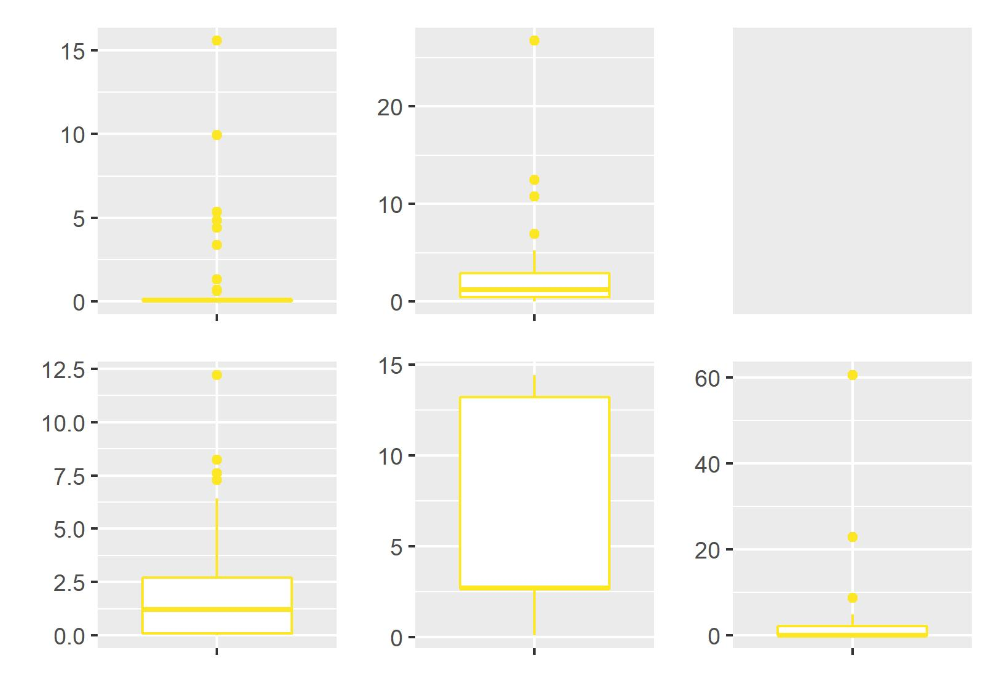

```{r setup, include=FALSE}
options(htmltools.dir.version = FALSE)
knitr::opts_chunk$set(
  fig.width=9, fig.height=3.5, fig.retina=3,
  fig.showtext = TRUE,
  out.width = "100%",
  cache = FALSE,
  echo = FALSE,
  message = FALSE, 
  warning = FALSE,
  hiline = TRUE
)
```

```{r xaringan-themer, include=FALSE, warning=FALSE}
# library(xaringanthemer)
# style_mono_accent(
#   base_color = "#1c5253",
#   header_font_google = google_font("Josefin Sans"),
#   text_font_google   = google_font("Montserrat", "300", "300i"),
#   code_font_google   = google_font("Fira Mono")
# )
```

```{r xaringan-panelset, echo=FALSE}
xaringanExtra::use_panelset()
```

```{r xaringan-logo, echo=FALSE}
xaringanExtra::use_logo("imagens/ime.png")
```

```{r xaringan-scribble, echo=FALSE}
# xaringanExtra::use_scribble()
```

```{r dados, include=FALSE}
library(magrittr)
```


## Sumário

### 1. [Introdução e Objetivos](#intro)
### 2. [Descrição do Estudo](#desc)
### 3. [Descrição das Variáveis](#variaveis)
### 4. [Análise Descritiva](#analise)
### 5. [Conclusões](#conclusoes)
### 6. [Próximos Passos](#proximos)


---
class: inverse center middle
name: intro
# Introdução

---
## Introdução

.left-column[
### Desenvolvimento infantil
<br><br><br><br>
### Premissa
]

.right-column[
>O desenvolvimento infantil e a plasticidade cerebral são maiores nos primeiros anos de vida. Sendo assim, quaisquer perturbações no ambiente ou no indivíduo impactam substancialmente na aquisição das habilidades motoras e cognitivas".  

<p style='text-align: right;'>-- Fundação Oswaldo Cruz</p>

 <br><br>
- Reflexos representam apenas uma pequena parte do comportamento motor inicial dos indivíduos;  
  
- Bebês já apresentam comportamento **ativo** (voluntário) desde o nascimento;
  
- Comportamento manual não é um reflexo;

- Os movimentos espontâneos (voluntários) são influenciados por restrições ambientais.  
]

???
_A plasticidade cerebral é a habilidade do cérebro de se recuperar e se reestruturar._

_Ou seja, a literatura hoje aponta a capacidade dos bebes de conrolar o próprio corpo e de interagir ativamente com o ambiente físico e social que o cerca_

---
## Por que é importante?
 
--
- Esse tipo de estudo considera o protagonismo dos bebês no seu próprio processo de desenvolvimento motor;

--

- Auxilia a pensar em novas formas de estimular o potencial ativo dos recém-nascidos em seus primeiros meses de vida;

--

- Auxilia no entendimento do processo de aprendizado em recém-nascidos, e seu comportamento frente a percepção de alterações ambientais (percepção-ação)

<center></center>


---

## Objetivos

.left-column[
### Geral<br><br><br>
### Pontuais
]

.right-column[
Investigar a emergência e desenvolvimento do comportamento voluntário das mãos 
em bebês de até três meses de idade, com base em alguns cenários experimentais.
<br><br><br>
- Descrever o comportamento de apertar ao longo dos três primeiros meses após o nascimento.

- Verificar se bebês de um a três meses são capazes de identificar a existência de um relacionamento entre o seu próprio comportamento de apertar e alterações no contexto ambiental. **O bebê identifica a relação entre a sua ação de apertar e um determinado acontecimento no ambiente?**

- Identificar se as relações do comportamento manual com os eventos ambientais se alteram ao longo de três sessões de prática na situação experimental. **Há aprendizado ao longo dos dias de experimento?**.

] 
  
---
class: inverse center middle
name: desc

# Descrição do estudo

---
## Sobre o experimento

.pull-left[
Os bebês foram colocados sentados em uma cadeira em frente a um monitor, em uma
posição estável. Um sensor de pressão foi posicionado na mão do bebê, para 
captar os apertos durante o experimento.

O estudo foi realizado de maneira presencial em três sessões individuais, dentro
de um período de 7 dias e consistiu em apresentar aos bebês **quatro condições 
experimentais**

Para cada condição, eram registrados os dados de pressão palmar relacionados aos
apertos que os bebês realizaram sobre o equipamento.
]

.pull-right[
<center></center>
<center></center>
]

---
## Sobre o experimento

--
.pull-left[
### Condições experimentais

- **Condição Basal**: sem nenhuma variação ambiental (duração = 2 min);  

- **Contingente**: um vídeo aparecia se o bebê atingisse determinada pressão 
palmar (duração = 4 min);  

- **Não Contingente**: um vídeo aparecia de forma automática e aleatória, sem 
que o bebê atingisse o valor de pressão estipulado (duração = 4 min);  

- **Condição Basal 2**: segunda condição sem estímulo visual (duração = 2 min)
]

--
.pull-right[
### Gatilho para o disparo do vídeo 

- Corresponde à pressão exercida pelo bebê durante 70% do tempo de coleta na 
primeira tentativa Basal;  

- O valor varia de criança para criança e se altera em cada dia de sessão;  

- Caso o participante não tenha atingido a frequência de 70% em algum dos dias 
do experimento, foi estipulada a pressão gatilho de 0,2 mmHg.
]

???
_Condições Contingentes e Não Contingente foram apresentadas em ordem aleatória para cada bebê_
---
## Sobre o experimento

.pull-left[
### Participantes

- 22 bebês ao todo  

**Pré-requisitos**: 
  - nascimento entre 38 a 42 semanas de gestação sem nenhuma complicação médica no parto;  
  
  - ser considerado saudável por seus médicos de acompanhamento;  
  
  - estar na faixa etária de 1 a 3 meses de vida
]

.pull-right[
### Limitações

- Interrupção de alguns processos de coleta de dados por causa da condição comportamental dos participantes;  
  
- Tempo de observação cortado para alguns bebês;  

- Número pequeno de participantes no estudo e quantidade diferente de participantes em cada faixa etária;  

- Processo de aleatorização das condições Contingente e Não Contingente
]

???
_O estado de alerta do bebê durante o procedimento pode ser um fator que influencia sua responsividade a estímulos e o cenário "perfeito" para a execução do teste seria quando o indivíduo estivesse quieto e acordado._

_Como a ordem de apresentação de ambas não é a mesma para os bebês isso pode comprometer a caracterização de um padrão no comportamento de apertar._

---
class: inverse center middle
name: variaveis

# Descrição das variáveis

---
## Descrição das variáveis

### Variáveis originais

Para cada condição e dia do experimento, foram coletados os valores de 
pressão palmar realizada pelos participante ao longo do tempo.

.pull-left[
- *Bebê*  

- *Vídeo* (0 = sem vídeo e 1 = com vídeo)  

- *Tempo* (em segundos)  

- *Pressão* (em mmHg)  

- *Dia* (1, 2 ou 3)  

- *Grupo* (1, 2 ou 3 meses de idade)  

- *Condição* (c, nc, bas, bas2)
]

.pull-right[

]

---

### Variáveis agrupadas

Calculadas pela pesquisadora através dos dados brutos do experimento. **Valores agrupados para cada bebê-dia-condição**. Após o tratamento das informações, obtivemos as seguintes variáveis:

- *N_apertos*
  
  A iniciação do aperto foi identificada em qualquer momento em que a pressão exercida pelo bebê fosse maior que a pressão média dentro da tentativa mais 10% desse valor. 
  
- *Freq_apertos* (apertos/min)
- *Media_pressao* (mmHg)
- *Pico*: pressão máxima (mmHg)  
  
  O pico foi definido como a pressão máxima exercida dentro de cada um dos apertos  
  
- *Media_pressao_pico* (mmHg)
- *Media_duracao_aperto* (milissegundos)

---
class: inverse center middle
name: analise

# Análise descritiva
---
class: middle
### Grupo

.pull-left[
```{r}
cea2::da_metadados %>% 
  dplyr::distinct(grupo, nome) %>% 
  dplyr::count(grupo) %>% 
  dplyr::mutate(grupo = dplyr::case_when(
    grupo == "b1" ~ "1 mês",
    grupo == "b2" ~ "2 meses",
    grupo == "b3" ~ "3 meses"
  )) %>% 
  dplyr::mutate(prop = formattable::percent(n/sum(n))) %>% 
  janitor::adorn_totals() %>% 
  knitr::kable(col.names = c("Grupo", "N", "%")) %>% 
  kableExtra::kable_styling(full_width = TRUE)
```
]

.pull-right[
- A influência da **Idade** na pressão exercida é um dos fatores de possível interesse na análise;  

- Quantidade desbalanceada de bebês em cada categoria;  

- Alguns participantes não possuem registros para determinadas condições.
]

---
### Medidas Resumo

.pull-left[
- pressão por **Dia**: não há grande diferença entre as pressões médias e medianas;

- Pressão por **Grupo**: indica uma maior diferenciação nas medidas resumos do Grupo 3;  

- Pressão por **Condição**: indica que a pressão média nas condições Basal 1 e Não Contingente são mais altas, enquanto a mediana do Não Contingente é a maior entre as condições

]
.pull-right[
.panelset[
.panel[.panel-name[Dia]
```{r}
# Média por agrupamento
media_grupo <- function(da, variavel, ...) {
  da %>%  dplyr::mutate(grupo = dplyr::case_when(grupo == 'b1' ~ 1,
                                         grupo == 'b2' ~ 2,
                                         grupo == 'b3' ~ 3)) %>% 
    dplyr::group_by(...) %>%
    dplyr::summarise(
      "media_{{variavel}}" := mean({{variavel}}),
      "dp_{{variavel}}" := sd({{variavel}}),
      "mediana_{{variavel}}" := median({{variavel}}),
      .groups = "drop"
    )
}

media_grupo(cea2::da_tidy, pressao, dia) %>% 
  #janitor::adorn_totals() %>% 
  dplyr::mutate(dplyr::across(2:4, ~round(.x, 3))) %>% 
  knitr::kable(col.names = c("Dia", "Pressão Média", "Desvio Padrão", "Pressão Mediana")) %>% 
  kableExtra::kable_styling(full_width = TRUE)
```
]
.panel[.panel-name[Grupo]
```{r}
media_grupo(cea2::da_tidy, pressao, grupo)  %>% 
  #janitor::adorn_totals() %>% 
  dplyr::mutate(dplyr::across(2:4, ~round(.x, 3))) %>% 
  knitr::kable(col.names = c("Grupo", "Pressão Média", "Desvio Padrão", "Pressão Mediana")) %>% 
  kableExtra::kable_styling(full_width = TRUE)
```
]
.panel[.panel-name[Condição]
```{r}
media_grupo(cea2::da_tidy, pressao, condicao)  %>% 
  #janitor::adorn_totals() %>% 
  dplyr::mutate(dplyr::across(2:4, ~round(.x, 3))) %>% 
  knitr::kable(col.names = c("Condição", "Pressão Média", "Desvio Padrão", "Pressão Mediana")) %>% 
  kableExtra::kable_styling(full_width = TRUE)

```
]
]]

???
Distruição dos dados simétrica

Geral: Pressão Média = 0.18, Desvio Padrão = 0.13, Pressão Mediana = 0.17
---
.left-column[

### Pressão média

- Na condição **Basal 1**, percebe-se uma relação direta da pressão média com a idade do bebê;  
  
- As diferenças de pressão média diminuem ao longo dos dias;  

- Já na **Basal 2**, essa relação não se observa, chegando a se inverter no segundo dia
]

.right-column[
```{r fig.height = 6}
cea2::da_tidy %>% 
  dplyr::mutate(condicao = dplyr::case_when(
    condicao == "basal1" ~ "Basal 1",
    condicao == "contingente" ~ "Contingente",
    condicao == "não contingente" ~ "Não contingente",
    condicao == "basal2" ~ "Basal 2"),
    grupo = dplyr::case_when(
      grupo == 'b1' ~ '1',
      grupo == 'b2' ~ '2',
      grupo == 'b3' ~ '3',
  )) %>% 
  dplyr::group_by(grupo, condicao, dia) %>%
  dplyr::summarise(media = mean(pressao, na.rm = TRUE)) %>%
  ggplot2::ggplot(ggplot2::aes(x = dia, y = media, fill = grupo)) +
  ggplot2::geom_bar(stat = "identity", position = "dodge") +
  ggplot2::facet_wrap(~condicao)+
  ggplot2::labs(
    x = "Dia",
    y = "Pressão Média"
  ) +
  ggplot2::theme_minimal(14) +
  ggplot2::scale_fill_manual(values = c("#440154FF", "#21908CFF", "#FDE725FF"))

```
]

???

- IMPORTANTE: Alguns bebês têm um tempo de coleta maior do que o definido, o que pode alterar os resultados, mas optamos por mantê-los para discutir com a pesquisadora como lidar nesses casos

---
.left-column[
### Pressão média

- Nas condições **Contingente** e **Não Contingente**, a pressão média é um pouco menor do que nas Basais;

- Não parece existir relação entre a pressão e a idade;

- Pode indicar uma resposta parecida ao estímulo, independentemente da idade.
]

.right-column[
```{r fig.height = 6}
cea2::da_tidy %>% 
  dplyr::mutate(condicao = dplyr::case_when(
    condicao == "basal1" ~ "Basal 1",
    condicao == "contingente" ~ "Contingente",
    condicao == "não contingente" ~ "Não contingente",
    condicao == "basal2" ~ "Basal 2"),
    grupo = dplyr::case_when(
      grupo == 'b1' ~ '1',
      grupo == 'b2' ~ '2',
      grupo == 'b3' ~ '3'
    )) %>% 
  dplyr::group_by(grupo, condicao, dia) %>%
  dplyr::summarise(media = mean(pressao, na.rm = TRUE)) %>%
  ggplot2::ggplot(ggplot2::aes(x = dia, y = media, fill = grupo)) +
  ggplot2::geom_bar(stat = "identity", position = "dodge") +
  ggplot2::facet_wrap(~condicao)+
  ggplot2::labs(
    x = "Dia",
    y = "Pressão Média"
  ) +
  ggplot2::theme_minimal(14) +
  ggplot2::scale_fill_manual(values = c("#440154FF", "#21908CFF", "#FDE725FF"))

```
]

---
### Pressão média ao longo do tempo
.left-column[

- **Contingente:** a média parece se manter mais estável em comparação com a Basal;  
  
- Pressão média aumenta gradualmente no início e se mantém num patamar elevado;  
  
- Na Basal, a pressão média oscila muito mais no final da sessão
]

.right-column[
```{r}
cea2::hc_grupo("b1") %>% 
  highcharter::hc_title(text = "Pressão média por segundo - Grupo 1")
```
]

???
- Algumas observações de pressão (outliers) foram retiradas pois puxavam a média para cima em determinados momentos
- Na contingente, a média parece se manter mais estável ao longo do tempo em comparação com a basal
- Na contingente, a pressão média aumenta gradualmente no início e se mantém num patamar elevado 
- Na basal, a pressão média oscila muito mais no último terço da sessão e não apresenta o crescimento gradual da contingente

---
### Pressão média ao longo do tempo
.left-column[

- Diferentemente do Grupo 1, a Basal também apresenta crescimento gradual no início, com decaimento no final;  
  
- Esse comportamento pode indicar uma maior diferença entre idades na condição Basal, mas não na Contingente;  
  
- A pressão média na condição Basal é mais alta
]

.right-column[
```{r}
cea2::hc_grupo("b2") %>% 
  highcharter::hc_title(text = "Pressão média por segundo - Grupo 2")
```
]

???
- A contingente tem um crescimento gradual, mas, diferentemente do grupo 1, a basal também apresenta esse comportamento no início, com decaimento no final
- Esse comportamento condiz com o gráfico da pressão média por grupo, pois parece indicar uma maior diferença entre idades na condição basal, mas não na contingente
- No grupo 2 observamos que, de fato, a pressão média na condição basal é mais alta que na contingente

---
### Pressão média ao longo do tempo
.left-column[
- Assim como nos outros grupos, a pressão média na condição Basal oscila mais que na Contingente;  
  
- Semelhança com o grupo 2: de início, tanto na Basal quanto na Contingente, há um aumento gradual da pressão média, com a pressão média da Basal sempre superior à da Contingente
]

.right-column[
```{r}
cea2::hc_grupo("b3") %>% 
  highcharter::hc_title(text = "Pressão média por segundo - Grupo 3")
```
]

???
- Semelhanças com os outros grupos: a pressão média na condição basal oscila mais que na contingente
- Semelhança com o grupo 2: de início, tanto na basal quanto na contingente, há um aumento gradual da pressão média, com a pressão média da basal sempre superior à da contingente
- Devemos olhar esse gráfico com cautela, pois neste grupo não temos os dados de dois bebês para um dos dias (dias diferentes)

---

.left-column[
### Pressão média ao longo do tempo: grupos 1, 2 e 3

Comparações entre a pressão média na primeira condição Basal e na condição Contingente
]
.right-column[
```{r}
cea2::hc_grupo("b1") %>% highcharter::hc_size(height = 200)  
cea2::hc_grupo("b2") %>% highcharter::hc_size(height = 200)  
cea2::hc_grupo("b3") %>% highcharter::hc_size(height = 200) 
```
]

---
.left-column[
### Pressão x Tempo (Grupo 1 - Contingente)

- Comportamento entre indivíduos de um mesmo grupo é heterogêneo

- Presença de valores de pressão outliers que posssivelmente devem ser cortados da amostra
]

.right-column[

]

---
.left-column[
### Pressão x Tempo (Grupo 2 - Contingente)

- Alguns bebês ativam mais o vídeo ao final da sessão, o que pode indicar que houve "aprendizado" do mecanismo do experimento

- Comportamento diferente não só entre bebês, mas também entre dias para o mesmo bebê

]

.right-column[

]

---
.left-column[
### Pressão x Tempo (Grupo 3 - Contingente)

- Também não há um padrão aparente para o comportamento ao longo dos dias

- Para alguns bebês, houve mais ativações do vídeo no último dia, enquanto outros tiveram mais sucesso no primeiro dia
]

.right-column[

]

---

.left-column[
### Número de apertos - Basal 2

- **Grupo 1**: número de apertos maior no dia 1 em comparação aos demais dias;    
- **Grupo 2**: número de apertos maior no dia 1 quando comparados com o dia 2 e o dia 3;  
- **Grupo 3**: apresenta um aumento no número de apertos do dia 3 em relação aos dias anteriores;  
]

.right-column[
.panelset[
.panel[.panel-name[Dias 1 e 2]
```{r}
da_apertos <- cea2::da_spss %>% 
  dplyr::filter(condicao == "pos") %>% 
  dplyr::transmute(
    nome, grupo = as.character(grupo), 
    dia = stringr::str_c("dia", dia), n_apertos
  ) %>% 
  tidyr::pivot_wider(names_from = dia, values_from = n_apertos)

d12 <- da_apertos %>% 
  ggplot2::ggplot(ggplot2::aes(x = dia1, y = dia2, colour = grupo)) +
  ggplot2::geom_point() +
  ggplot2::theme_minimal() +
  ggplot2::labs(x = "Apertos no dia 1", y = "Apertos no dia 2") +
  ggplot2::scale_colour_viridis_d() +
  ggplot2::geom_abline(slope = 1, intercept = 0, alpha = .5) +
  ggplot2::geom_hline(
    linetype = "dotted", alpha = .3,
    yintercept = median(da_apertos$dia2, na.rm = TRUE)
  ) +
  ggplot2::geom_vline(
    linetype = "dotted", alpha = .3, 
    xintercept = median(da_apertos$dia1, na.rm = TRUE)
  ) 
  
plotly::ggplotly(d12, height = 420)
```
]
.panel[.panel-name[Dias 2 e 3]
```{r}
d23 <- da_apertos %>% 
  ggplot2::ggplot(ggplot2::aes(x = dia2, y = dia3, colour = grupo)) +
  ggplot2::geom_point() +
  ggplot2::theme_minimal() +
  ggplot2::labs(x = "Apertos no dia 2", y = "Apertos no dia 3") +
  ggplot2::scale_colour_viridis_d() +
  ggplot2::geom_abline(slope = 1, intercept = 0, alpha = .5) +
  ggplot2::geom_hline(
    linetype = "dotted", alpha = .3,
    yintercept = median(da_apertos$dia3, na.rm = TRUE)
  ) +
  ggplot2::geom_vline(
    linetype = "dotted", alpha = .3, 
    xintercept = median(da_apertos$dia2, na.rm = TRUE)
  ) 

plotly::ggplotly(d23, height = 420)
```
]

.panel[.panel-name[Dias 1 e 3]
```{r}
d13 <- da_apertos %>% 
  ggplot2::ggplot(ggplot2::aes(x = dia1, y = dia3, colour = grupo)) +
  ggplot2::geom_point() +
  ggplot2::theme_minimal() +
  ggplot2::labs(x = "Apertos no dia 1", y = "Apertos no dia 3") +
  ggplot2::scale_colour_viridis_d() +
  ggplot2::geom_abline(slope = 1, intercept = 0, alpha = .5) +
  ggplot2::geom_hline(
    linetype = "dotted", alpha = .3,
    yintercept = median(da_apertos$dia3, na.rm = TRUE)
  ) +
  ggplot2::geom_vline(
    linetype = "dotted", alpha = .3, 
    xintercept = median(da_apertos$dia1, na.rm = TRUE)
  ) 
plotly::ggplotly(d13, height = 420)
```
]
]]

```{r}
# da_dia <- cea2::da_spss %>%
#   dplyr::filter(condicao %in% c("bas", "pos")) %>%
#   dplyr::mutate(condicao = ifelse(condicao == "pos", "Basal 2", "Basal 1")) %>%
#   dplyr::select(nome,condicao, grupo, dia, n_apertos) %>%
#   dplyr::mutate(dia = dplyr::case_when(
#     dia == 1 ~ "dia_1",
#     dia == 2 ~ "dia_2",
#     TRUE ~ "dia_3"
#   )) %>%
#   #dplyr::filter(grupo == 1) %>%
#   tidyr::pivot_wider(names_from = dia, values_from = n_apertos)
# 
# #Dia 1 e Dia 2
# d12 = da_dia %>%
#   ggplot2::ggplot(ggplot2::aes(x = dia_1, y = dia_2, colour = condicao, shape = grupo)) +
#   ggplot2::geom_point() +
#   ggplot2::geom_abline(slope = 1, intercept = 0)
# 
# plotly::ggplotly(d12)  %>%
#   plotly::layout(title = 'Número de apertos: Dia 1 x Dia 2',xaxis = list(title = 'Dia 1'),
#                  yaxis = list(title = 'Dia 2'))
```

```{r height 10}
#Dia 2 e Dia 3
# d23 <- da_dia %>%
#   ggplot2::ggplot(ggplot2::aes(x = dia_2, y = dia_3, colour = condicao, shape = grupo)) +
#   ggplot2::geom_point() +
#   ggplot2::geom_abline(slope = 1, intercept = 0)
# 
# plotly::ggplotly(d23)  %>%
#   plotly::layout(title = 'Número de apertos: Dia 2 x Dia 3',xaxis = list(title = 'Dia 2'),
#                  yaxis = list(title = 'Dia 3'))
```

```{r}
# Dia 1 e Dia 3
# d13 <- da_dia %>%
#   ggplot2::ggplot(ggplot2::aes(x = dia_1, y = dia_3, colour = condicao, shape = grupo)) +
#   ggplot2::geom_point() +
#   ggplot2::geom_abline(slope = 1, intercept = 0)
# 
# plotly::ggplotly(d13)  %>%
#   plotly::layout(title = 'Número de apertos: Dia 1 x Dia 3',xaxis = list(title = 'Dia 1'),
#                  yaxis = list(title = 'Dia 3'))

```

---

.left-column[
### Número de apertos - Basal 1 x Basal 2
]

.right-column[
.panelset[
.panel[.panel-name[Dia 1]

```{r}
da_dia <- cea2::da_spss %>%
   dplyr::filter(condicao %in% c("bas", "pos")) %>%
   dplyr::mutate(condicao = ifelse(condicao == "pos", "Basal 2", "Basal 1")) %>%
   dplyr::select(nome,condicao, grupo, dia, n_apertos) %>%
  dplyr::mutate(condicao = dplyr::case_when(
    condicao == "Basal 1" ~ "Basal_1",
    TRUE ~ "Basal_2"
  )) %>%
   #dplyr::filter(grupo == 1) %>%
   tidyr::pivot_wider(names_from = condicao, values_from = n_apertos)
 
 #Dia 1
d1 = da_dia %>%
  dplyr::filter(dia == 1)%>%
   ggplot2::ggplot(ggplot2::aes(x = Basal_1, y = Basal_2, colour = grupo)) +
   ggplot2::geom_point() +   
  ggplot2::theme_minimal() +
   ggplot2::geom_abline(slope = 1, intercept = 0)+
  ggplot2::labs(x = "Apertos na Basal 1", y = "Apertos na Basal 2") +
  ggplot2::scale_colour_viridis_d() 
 
 plotly::ggplotly(d1, height = 420) 
```
]
.panel[.panel-name[Dia 2]
```{r}
 #Dia 2
 d2 = da_dia %>%
   dplyr::filter(dia == 2)%>%
   ggplot2::ggplot(ggplot2::aes(x = Basal_1, y = Basal_2, colour = grupo)) +
   ggplot2::geom_point() +   
   ggplot2::theme_minimal() +
   ggplot2::geom_abline(slope = 1, intercept = 0)+
   ggplot2::labs(x = "Apertos na Basal 1", y = "Apertos na Basal 2") +
   ggplot2::scale_colour_viridis_d() 
 
 plotly::ggplotly(d2, height = 420) 
```
]
.panel[.panel-name[Dia 3]
```{r}
#Dia 3
 d3 = da_dia %>%
   dplyr::filter(dia == 3)%>%
   ggplot2::ggplot(ggplot2::aes(x = Basal_1, y = Basal_2, colour = grupo)) +
   ggplot2::geom_point() +   
   ggplot2::theme_minimal() +
   ggplot2::geom_abline(slope = 1, intercept = 0)+
   ggplot2::labs(x = "Apertos na Basal 1", y = "Apertos na Basal 2") +
   ggplot2::scale_colour_viridis_d() 
 
 plotly::ggplotly(d3, height = 420) 
 
```
]
]]

---

## Tempo entre disparo do vídeo 

.pull-left[
### Dia 1 - Contingente - Grupo 1 

]

.pull-right[
### Dia 3 - Contingente - Grupo 1 

]

---

.pull-left[
### Dia 1 - Contingente - Grupo 2 

]

.pull-right[
### Dia 3 - Contingente - Grupo 2

]

---

.pull-left[
### Dia 1 - Contingente - Grupo 3 

]

.pull-right[
### Dia 3 - Contingente - Grupo 3

]
---
class: inverse center middle
name: conclusoes
# Conclusões

---

## Conclusões

--

- Parece existir uma diferença entre o padrão de apertar quando comparamos as tentativas sem estímulo (Basal e Basal 2) com a condição com estímulo (Contingente);  
  
--

- Há uma diferença muito grande no comportamento dos bebês de uma mesma faixa etária;

--

- A pressão média na condição basal oscila mais que na condição contingente

--

- Parece existir um aprendizado nos bebês mais velhos (Grupo 3), pois esses apresentaram um aumento no número de apertos quando comparamos o Dia 3 com os dias anteriores

--

- A princípio não foi possível observar um padrão no intervalo entre a ativação dos vídeos
---
class: inverse center middle
name: proximos
# Próximos passos
---

## Próximos passos

--

- Alinhamento com a pesquisadora acerca de possíveis inconsistências na base;  
  
--

- Definição das variáveis a serem utilizadas na modelagem (varias opções);  
  
--

- Definição de um modelo adequado a estrutura dos dados;  
  
--

- Aceitamos sugestões

---
class: center, middle

# Obrigada!

### Dúvidas?

[**slides**](https://rmhirota.github.io/cea2/pres/apresentacao1.html)<br>
[**análises**](https://github.com/rmhirota/cea2)

