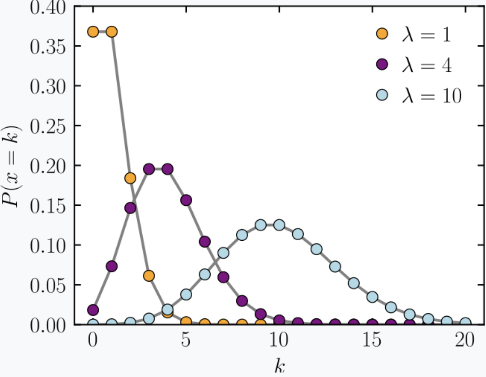

```{r setup, include=FALSE}
options(htmltools.dir.version = FALSE)
knitr::opts_chunk$set(
  fig.width=9, fig.height=3.5, fig.retina=3,
  fig.showtext = TRUE,
  out.width = "100%",
  cache = FALSE,
  echo = FALSE,
  message = FALSE, 
  warning = FALSE,
  hiline = TRUE
)
```

```{r xaringan-themer, include=FALSE, warning=FALSE}
# library(xaringanthemer)
# style_mono_accent(
#   base_color = "#1c5253",
#   header_font_google = google_font("Josefin Sans"),
#   text_font_google   = google_font("Montserrat", "300", "300i"),
#   code_font_google   = google_font("Fira Mono")
# )
```

```{r xaringan-panelset, echo=FALSE}
xaringanExtra::use_panelset()
```

```{r xaringan-logo, echo=FALSE}
xaringanExtra::use_logo("imagens/ime.png")
```

```{r xaringan-scribble, echo=FALSE}
# xaringanExtra::use_scribble()
```

```{r dados, include=FALSE}
library(magrittr)
```


## Sumário

### 1. [Processo de Contagem](#processo)
### 2. [FBST](#fbst)
### 3. [Teste Não Paramétrico](#teste)
### 4. Próximos Passos
### 5. Bibliografia


---
class: inverse center middle
name: processo
# Processo de Contagem

---
## Distribuição de Poisson

Seja $X$ uma v.a. assumindo um dos valores 0, 1, 2, ..., possue distribuição de Poisson com parâmetro $\lambda$, se para algum $\lambda$ > 0:

$$X ∼ Poisson(\lambda)$$

cuja função de probabilidade é dada por

$$P(X = k) = \frac{\lambda^{k}e^{-\lambda}}{k!}$$

<center></center>


???
_Seja a variável aleatória X o número de ocorrências por intervalo
fixo (de tempo ou espaço). Dizemos que X tem distribuição de
Poisson com parametro lambda_

---
## Processo de Contagem

**Processo estocástico** = conjunto de variáveis aletórias que depende de um parâmetro t (tempo)

O processo estocástico N(t) chama-se de contagem, se ele “conta” quantos eventos ocorreram durante o intervalo de tempo (0, t]

### Propriedades:

- N(t) $\geq$ 0
  
- N(t) é um número inteiro
  
- Se s < t, then N(s) $\leq$ N(t) 
 
- Para s < t, N(t) − N(s) representa o número de eventos que ocorreram no intervalo (s, t]

???
é uma família de variáveis aleatórias representando a evolução de um sistema de valores com o tempo

---
Um processo de contagem N(t) é um processo de Poisson com intensidade $\lambda$, $\lambda$ > 0, se

.pull-left[
### Definição 1

- No instante inicial nenhum evento ocorreu (N(0) = 0);
  
- N(t + s) − N(s) não depende do N(s) para quaisquer t;
  
- $$P[N(t + s) − N(s) = n] = \frac{e^{-\lambda*t}*(\lambda*t)^{n}}{n!}$$ 

com n = 0, 1,...  e s ≥ 0, t > 0


]

--
.pull-right[
### Definição 2

- Os tempos entre as ocorrências de um processo de Poisson possuem distribuição exponencial
 
 $T_{n}$ = o tempo entre a (n − 1) e n-ésima ocorrência de eventos

- Perda de memória 

Se $$T \sim Exponencial(\alpha)$$
Logo, 

$$P(T > t + s/T > t) = \frac{P(T > t + s, T > t)}{P(T > t)} = \\ \frac{P(T > t + s)}{P(T > t)} =
\frac{e^{-\alpha(t+s)}}{e^{-\alpha*t}} = e^{-\alpha*s} = P(T > s)$$


]

???

_O Processo de Poisson pode ser um modelo para uma série de eventos discretos onde o tempo entre os eventos é conhecido, mas o tempo preciso dos eventos é aleatório. A chegada de uma ocasião é independente do evento anterior (o tempo de espera entre os eventos é sem memória)_

_o processo tem incrementos independentes_

_o número de eventos em qualquer intervalo de comprimento t é uma variável aleatória de Poisson com média λt_

_Dist Exponencial = Frequentemente usada para modelar o tempo entre eventos que
ocorrem a uma taxa m´edia constante_

_A probabilidade de que o instrumento viva por pelo menos s + t horas, dado que tem
sobreviveu t horas é o mesmo que a probabilidade inicial de que viva por pelo menos s horas_

---

## Contexto no trabalho

_Aperto_ = evento de interesse

_Tempo entre vídeo_ = tempos entre as ocorrências do possível processo de Poisson
\newline
\newline


- **Ideia**: Avaliar se os tempos entre vídeos, na condição contingente, se ajustam a algum modelo exponencial;

- **Objetivo**: Tentativa de verificar se a taxa entre apertos muda para cada bebê


Para o _i_-ésimo bebê no _j_-ésimo dia, temos

$$Tempo \; entre \; video_{ij} \sim  Poisson(\lambda_{ij}*t_{ij})$$

com $$t_{ij} = tempo \; da \; sessão$$
---
## Testes de exponencialidade

- **Gráfica**: Histogramas da variável _Tempo entre vídeo_ para cada bebê;

<center></center>

- **Kolmogorov - Smirnov**: estimação do parâmetro através da função _fitdistr_ 

---
class: inverse center middle
name: fbst

# Teste de Significância Genuinamente Bayesiano

---
## Inferência Bayesiana

Seja $\theta$ uma variável aleatória, tal que

$$posteriori \; \alpha \;  verossimilhança \; \alpha \; priori$$

- A distribuição priori deve representar probabilisticamente o conhecimento que se tem sobre o antes da realização do experimento

- O método de Monte Carlo é muito utilizado para estimação da priori 

---
## FBST

**Ideia**: estimar 36 parâmetros $\theta$ e compará-los entre si através de testes de hipótese 

**Objetivo**: comparar as taxas de apertos por minuto dos grupos x condição x dia, associando a cada bebê um processo de contagem de Poisson.
\newline
\newline

- Método proposto por **Pereira e Stern (1999)** 

- Highest Posterior Density

???
_objetivo de apresentar uma alternativa bayesiana aos testes de hipóteses precisas_
_Procedimento baseado em estimador por região (Highest Posterior Density)_

---
## e-value

Quantifica a evidência Bayesiana contra $H_{0}$ 

Definimos a medida de evidência de Pereira-Stern da
amostra x ∈ X para a hipótese $H_{0}$ por

$$E_{v}(\Theta_{0},x) = 1 - P(\theta \in T_{x} | X = x)$$
com

$$T_{x} = [\theta \in \Theta : f(\theta | X = x) > f(\theta_{0} | X = x)]$$
- É a área da posteriori no conjunto do espaço paramétrico de $\theta$ que consiste nos pontos com densidade menor do que no ponto máximo da densidade à posteriori sob $H_{0}$

- Rejeitar $H_{0}$ se, e só se, $E(\Theta_{0}, x)$ $\leq$ $\alpha$, $α ∈ [0, 1]$.

inserir imagem que o prof mandou

---
## Teste para hipóteses nulas compostas

$$H_{0}: \theta \in \Theta_{0} \\
   H_{0}: \theta \in \Theta_{1}$$

Definimos a medida de evidência de Pereira-Stern da amostra x ∈ X para a hipótese $H_{0}$ por

$$E_{v}(\Theta_{0},x) = 1 - P(\theta \in T_{x} | X = x)$$
com

$$T_{x} = [\theta \in \Theta : f(\theta | X = x) > sup_{\theta^{'}\in\Theta_{0}}f(\theta^{'} | X = x)]$$

---
## Próximos passos
  

- Tentaiva de um moedelo do tipo Medidas Repetidas;  
  

- Definição de um modelo adequado a estrutura dos dados;  
  

## Bibliografia


[Pereira e Stern (1999)](https://teses.usp.br/teses/disponiveis/45/45133/tde-09072012-103238/pt-br.php)

[Sheldon Ross - Introduce to probability models]()

[Inferência Estatística Comparada - Notas de aula sobre Inferência Bayesiana]()

---
