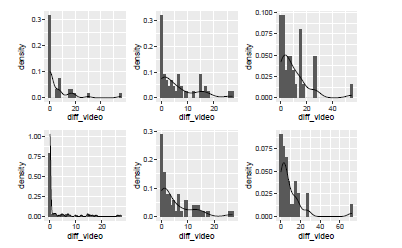

```{r setup, include=FALSE}
options(htmltools.dir.version = FALSE)
knitr::opts_chunk$set(
  fig.width=9, fig.height=3.5, fig.retina=3,
  fig.showtext = TRUE,
  out.width = "100%",
  cache = FALSE,
  echo = FALSE,
  message = FALSE, 
  warning = FALSE,
  hiline = TRUE
)
```

```{r xaringan-themer, include=FALSE, warning=FALSE}
# library(xaringanthemer)
# style_mono_accent(
#   base_color = "#1c5253",
#   header_font_google = google_font("Josefin Sans"),
#   text_font_google   = google_font("Montserrat", "300", "300i"),
#   code_font_google   = google_font("Fira Mono")
# )
```

```{r xaringan-panelset, echo=FALSE}
xaringanExtra::use_panelset()
```

```{r xaringan-logo, echo=FALSE}
xaringanExtra::use_logo("imagens/ime.png")
```

```{r xaringan-scribble, echo=FALSE}
# xaringanExtra::use_scribble()
```

```{r dados, include=FALSE}
library(magrittr)
```


## Sumário

### 1. [Processo de Contagem](#processo)
### 2. [FBST](#fbst)
### 3. [Teste Não Paramétrico](#teste)
### 4. [Próximos Passos](#proximos)
### 5. [Bibliografia](#conclusoes)


---
class: inverse center middle
name: processo
# Processo de Contagem

---
## Processo de Contagem

O processo N(t) chama-se de contagem, se ele “conta” quantos eventos ocorreram durante o intervalo de tempo (0, t]

$$X ∼ Poisson(\lambda)$$

com função de probabilidade

$$ P(X = k) = \frac{\lambda^{k}e^{-\lambda}}{k!}  $$
com $\lambda$ > 0 e k = 0,1,2...


???
_Seja a variável aleatória X o número de ocorrências por intervalo
fixo (de tempo ou espaço). Dizemos que X tem distribuição de
Poisson com parametro $\lambda$,

---

--
.pull-left[
### Definição 1

- No instante inicial nenhum evento ocorreu (N(0) = 0);
  
- N(t + s) − N(s) não depende do N(s) para quaisquer t, s ≤ 0;
  
- P{N(t + s) − N(s) = n} = $$\frac{e^{-\lambda*t}*(\lambda*t)^{n}}{n!}$$ , n = 0, 1,...

??? 
_2 = o processo tem incrementos independentes;
3 = o n´umero de eventos que ocorreram durante o tempo t
tem a distribuição de Poisson com média $\lambda$t_
]

--
.pull-right[
### Definição 2

- Os tempos entre as ocorrências de um processo de Poisson possuem distribuição exponencial;

- O processo possui a propriedade de “falta da memória”.

]

???
Dist Exponencial = Frequentemente usada para modelar o tempo entre eventos que
ocorrem a uma taxa m´edia constante.

---

Seja X ~ Exponencial($\lambda$)

$$P(X > t + s/X > t) = \frac{P(X > t + s, X > t)}{P(X > t)} = \frac{P(X > t + s)}{P(X > t)} =
\frac{e^{-\lambda(t+s)}}{e^{-\lambda*t}} = e^{-\lambda*s} = P(X > s)
$$


---
## Contexto no trabalho

Aperto = evento de interesse

Tempo entre vídeos = tempos entre as ocorrências do possível processo de Poisson

- **Ideia**: Avaliar se os tempos entre vídeos, na condição contingente, se ajustam a algum modelo exponencial;

- **Objetivo**: Tentativa de caracterizar a variável Tempo entre video

---
Para o i-ésimo bebê no j-ésimo dia, temos

$$ X_{ij} \sim  Poisson(\lambda_{ij}*t)  $$

com $t = tempo da sessão$
---
## Testes de exponencialidade

- **Gráfica**: Histogramas da variável Tempo entre disparo do vídeo para cada bebê;

<center></center>

- **Kolmogorov - Smirnov**: estimação do parâmetro através da função _fitdistr_ 

---
class: inverse center middle
name: fbst

# Teste de Significância Genuinamente Bayesiano

---
**Ideia**: estimar 36 $\theta$ e compará-los entre si através de testes de hipótese 

**Objetivo**: comparar as taxas de apertos por minuto dos grupos x condição x dia, associando a cada bebê um processo de contagem de Poisson.

Método proposto por **Pereira e Stern (1999)** com o objetivo de apresentar uma alternativa bayesiana aos testes de hipóteses precisas

Procedimento baseado em estimador por região (Highest Posterior Density)

---

### Inferência Bayesiana

Seja $\theta$ uma variável aleatória

$$posteriori \; \alpha \;  verossimilhança \; \alpha \; priori  $$

- A distribuição priori deve representar probabilisticamente o conhecimento que se tem sobre o antes da realização do experimento

- O método de Monte Carlo para estimação da priori 

---
# e-value

quantifica a evidência Bayesiana contra $H_{0}$ 

Definimos a medida de evidência de Pereira-Stern da
amostra x ∈ X para a hipótese $H_{0}$ por

$$ E_{v}(\Theta_{0},x) = 1 - P(\theta \in T_{x} | X = x) $$
com

$$ T_{x} = [\theta \in \Theta : f(\theta | X = x) > f(\theta_{0} | X = x)] $$
---

- É a área da posteriori no conjunto do espaço paramétrico de $\theta$ que consiste nos pontos com densidade menor do que no ponto máximo da densidade à posteriori sob $H_{0}$

- O procedimento de teste que consiste em rejeitar $H_{0}$ se, e só se, E($\Theta_{0}$, x) $\leq$ $\alpha$, $α ∈ [0, 1]$, é chamado procedimento de Pereira-Stern (ou FBST).

inserir imagem que o prof mandou

---
# Teste para hipóteses nulas compostas

$$ H_{0}: \theta \in \Theta_{0} \\
   H_{0}: \theta \in \Theta_{1}$$

Definimos a medida de evidência de Pereira-Stern da amostra x ∈ X para a hipótese $H_{0}$ por

$$ E_{v}(\Theta_{0},x) = 1 - P(\theta \in T_{x} | X = x) $$
com

$$ T_{x} = [\theta \in \Theta : f(\theta | X = x) > sup_{\theta^{'}\in\Theta_{0}}f(\theta^{'} | X = x)] $$
---  
class: inverse center middle
name: proximos
# Próximos passos
---

## Próximos passos
  
--

- Tentaiva de um moedelo do tipo Medidas Repetidas;  
  
--

- Definição de um modelo adequado a estrutura dos dados;  
  
--

---

# Bibliografia


[Pereira e Stern (1999)](https://teses.usp.br/teses/disponiveis/45/45133/tde-09072012-103238/pt-br.php)
[Sheldon Ross](Introduce to probability models)
[Inferência Estatística Comparada](Notas de aula sobre Inferência Bayesiana)

