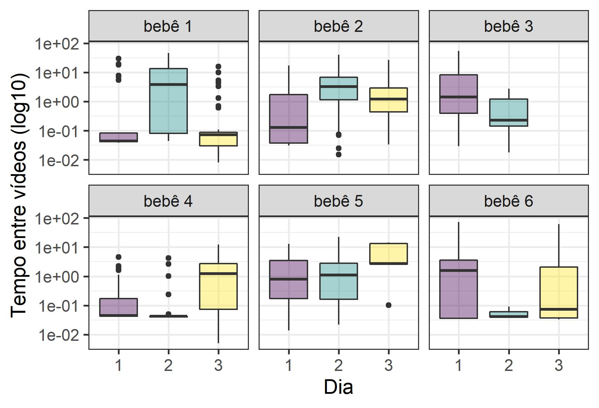
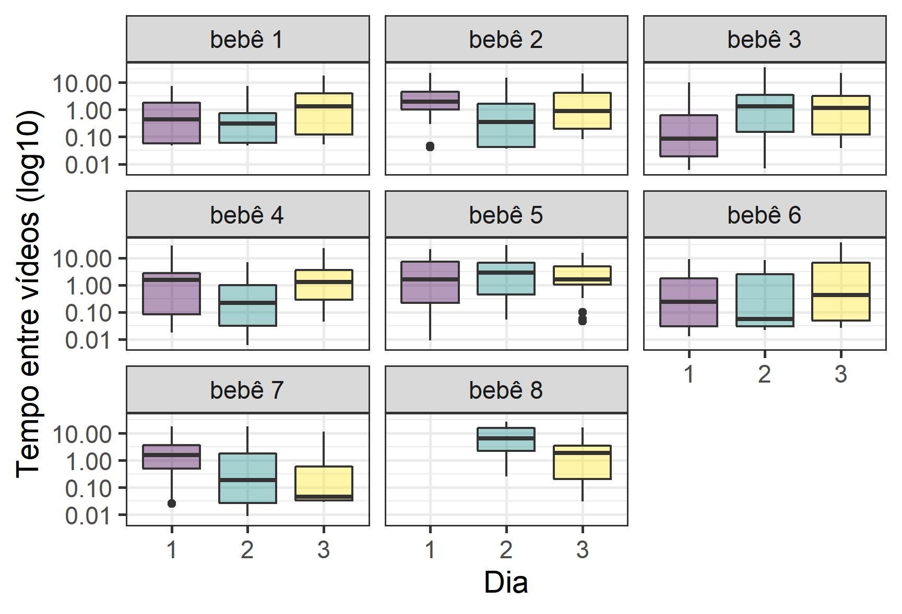
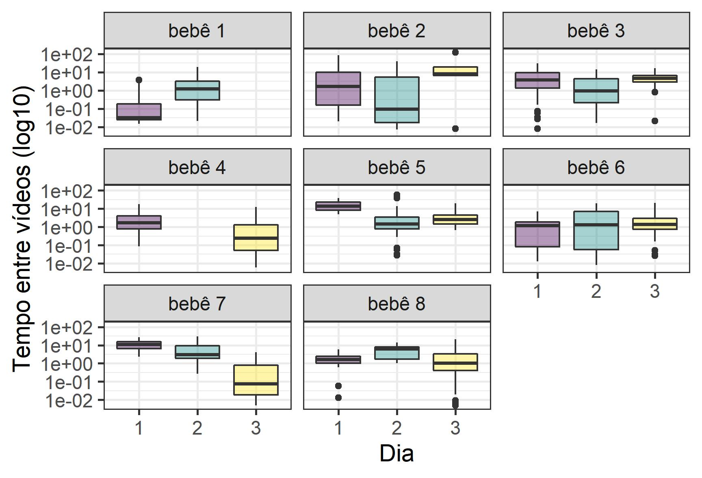
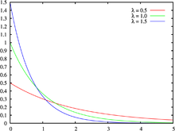
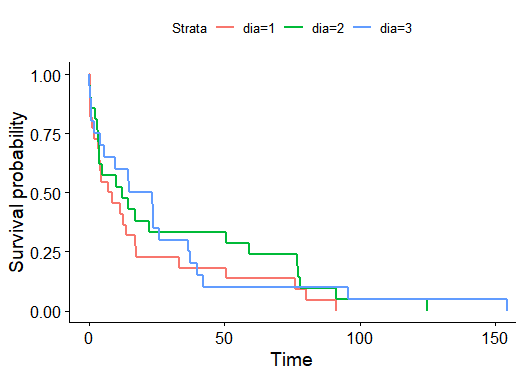

```{r setup, include=FALSE}
options(htmltools.dir.version = FALSE)
knitr::opts_chunk$set(
  fig.width=9, fig.height=3.5, fig.retina=3,
  fig.showtext = TRUE,
  out.width = "100%",
  cache = FALSE,
  echo = FALSE,
  message = FALSE, 
  warning = FALSE,
  hiline = TRUE
)
```

```{r xaringan-themer, include=FALSE, warning=FALSE}
# library(xaringanthemer)
# style_mono_accent(
#   base_color = "#1c5253",
#   header_font_google = google_font("Josefin Sans"),
#   text_font_google   = google_font("Montserrat", "300", "300i"),
#   code_font_google   = google_font("Fira Mono")
# )
```

```{r xaringan-panelset, echo=FALSE}
xaringanExtra::use_panelset()
```

```{r xaringan-logo, echo=FALSE}
xaringanExtra::use_logo("imagens/ime.png")
```

```{r xaringan-scribble, echo=FALSE}
# xaringanExtra::use_scribble()
```

```{r dados, include=FALSE}
library(magrittr)
```


## Sumário

### 1. [Relembrando o Estudo](#estudo)
### 2. [Atualizando a descritiva](#descritiva)
### 3. [Análise Inferencial](#processo)
### 5. Conclusões
### 6. Bibliografia

---
class: inverse center middle
name: estudo
# Relembrando o Estudo

---

Experimento dividido em 3 dias e 4 condições
<br><br>

.pull-left[
### Objetivo

- Verificar se bebês de um a três meses são capazes de identificar uma relação 
entre seus apertos e alterações no contexto ambiental;  

- Identificar se há indícios de aprendizado ao longo dos dias de experimento;

- Identificar se há indicíos de diferença na frequência de apertos entre os três grupos distintos de bebês

]

.pull-rigt[
### Estrutura do experimento

- **Condição Basal**: sem nenhuma variação ambiental;  

- **Contingente**: vídeo aparecia se o bebê atingisse determinada pressão palmar;  

- **Não Contingente**: vídeo aparecia de forma automática e aleatória, sem que o bebê atingisse o valor de pressão estipulado;  

- **Condição Basal 2**: segunda condição sem estímulo visual
]

---
## Limitações

- Interrupção de alguns processos de coleta de dados; 
<br><br> 
  
- Tempo de observação cortado para alguns bebês;  
<br><br>

- Número pequeno de participantes no estudo;
<br><br>

- Quantidade diferente de participantes em cada faixa etária;  
<br><br>

- Processo de aleatorização na ordem das condições Contingente e Não Contingente;
<br><br> 

- Cruzamento de Grupo x Dia x Condição 

---
class: inverse center middle
name: descritiva
# Atualizando a Descritiva

---

##Após primeira apresentação:

<br><br> 

- Segundo corte na base realizado;
<br><br> 

- Avaliação da _Frequência de apertos_ ao invés do _Número de apertos_;
<br><br>

- Transformação da escala do conjunto de boxplots em logarítmica, 
para melhor visualização dos resultados
<br><br>

- **Definição de uma nova variável**: Tempo entre apertos

---
## Boxplots

.left-column[
### Tempo entre vídeos (Grupo 1 - Contingente)

- Comportamento entre indivíduos de um mesmo grupo é heterogêneo

- A extenção dos boxplots indica uma grande variabilidade nessa variável.
]

.right-column[

]

---

.left-column[
### Tempo entre vídeos (Grupo 2 - Contingente)

- É o mais homogêneo quanto a variável tempo entre vídeos

- A maior diferença se dá com o bebê 8, que não tem dados para o dia 1, e possui valores maiores no dia 2. 
]

.right-column[

]
---
.left-column[
### Tempo entre vídeos (Grupo 3 - Contingente)

- Comportamento entre indivíduos de um mesmo grupo é heterogêneo

- A variabilidade do tempo entre vídeos é menor se comparado aos bebês com um mês de idade

]

.right-column[

]
---
class: inverse center middle
name: processo
# Análise Inferencial

---

### Tempo entre apertos

**Objetivo:** entender se a mesma se ajusta a uma distribuição exponencial

- Distribuição frequentemente usada para modelar o tempo entre eventos que ocorrem a uma taxa média constante

- Indicaria que chegada de um aperto é independente do evento anterior

<center></center>

---

Para a maioria dos bebês observados os testes de Kolmogorov-Smirnov rejeitaram a hipótese de exponencialidade dado por:

<br>

$$H_{0}: Tempo_{ijk} \sim Exponencial(\alpha_{ijk})$$
$$H_{1}: Tempo_{ijk} \not\sim Exponencial(\alpha_{ijk})$$

<br>

tal que $i$ = i-ésimo bebê, $j$ = j-ésimo dia de $k$ = k-ésima condição

<br><br>

###Exemplo:

```{r echo = FALSE}
bbs <- list(
  grupo = c("b1", "b2", "b3"),
  nome = c("eduarda", "arthur", "nicolas")
)

teste_ks <- function(g, n) {
  bb <- cea2::da_tidy %>%
  dplyr::filter(
    grupo == g, nome == n, condicao == "contingente", dia == "1"
  )  %>%
  dplyr::arrange(dia, tempo) %>%
  dplyr::filter(status_aperto %in% c("inicio", "fim")) %>%
  dplyr::mutate(diff_aperto = dplyr::case_when(
    status_aperto == "inicio" & dplyr::lag(status_aperto) == "fim"
    ~ (tempo - dplyr::lag(tempo))
  )) %>%
  dplyr::filter(!is.na(diff_aperto)) %>%
  dplyr::pull(diff_aperto)

  fit <- MASS::fitdistr(bb, "exponential")
  ks.test(bb, "pexp", fit$estimate) %>%
    broom::tidy()
}

purrr::map2_dfr(bbs$grupo, bbs$nome, teste_ks) %>%
  dplyr::mutate(bebe = c(1, 2, 3)) %>%
  dplyr::relocate(bebe) %>%
  knitr::kable()

```

---
### Primeira Conclusão

- Distribuição exponencial é a única dentre as contínuas com a característica de perda de memória; 

<br>

- Indício de que os apertos não ocorrem a uma taxa média constante;

<br>

- Fixados uma condição e dia de sessão, há indicíos de que um aperto de um bebê depende dos apertos executados anteriormente

---

### Teste de Kruskal Wallis

**Objetivo:** comparar a frequência de apertos por grupo, fixado um dia de sessão e uma condição experimental

<br><br> 

- Teste não paramétrico para verificar a igualdade de distribuições entre os grupos
<br><br> 

$$
\begin{cases}
H_{0} = \text{Todas as } três \text{ distribuições são idênticas} \\
H_1 = \text{Ao menos uma das populações tende a produzir valores maiores que as outras}
\end{cases}
$$

<br><br> 
  
  
$$T = \frac{12}{N + 1}\frac{\sum^{k}_{i=1}[R(X_{i}) - \frac{n_{i}}{2}(N + 1)]^{2}}{n_{i}} = \frac{12}{N + 1}\frac{\sum^{k}_{i=1}R_{i}^2}{n_{i}} - 3(N + 1)$$ 
---
```{r message=FALSE, warning=FALSE, include=FALSE}
library(magrittr)
da_spss <- readr::read_rds("~/CEA - 2021/TCC 2/cea2/data-raw/2_tidy_spss.rds")

teste_kw <- function(cond, d) {
  da <- da_spss %>%
    dplyr::filter(condicao == cond, dia == d) %>%
    dplyr::select(grupo, freq_apertos)
  g1 <- dplyr::filter(da, grupo == 1)
  g2 <- dplyr::filter(da, grupo == 2)
  g3 <- dplyr::filter(da, grupo == 3)
  kruskal.test(list(
    g1$freq_apertos, g2$freq_apertos, g3$freq_apertos
  ))
}
```

.pull-left[
**Contingente**
```{r echo=FALSE}
library(broom)
library(purrr)
d1 = teste_kw("c", 1)
d2 = teste_kw("c", 2) 
d3 = teste_kw("c", 3)

cbind(Dia = c("Dia 1","Dia 2","Dia 3"),map_df(list(d1,d2,d3), tidy) ) %>% dplyr::select(-parameter,-method) %>% knitr::kable()
```
<br><br>
**Não Contingente**
```{r echo=FALSE}
n1 = teste_kw("nc", 1)
n2 = teste_kw("nc", 2) 
n3 = teste_kw("nc", 3)

cbind(Dia = c("Dia 1","Dia 2","Dia 3"),map_df(list(n1,n2,n3), tidy) ) %>% dplyr::select(-parameter,-method) %>% knitr::kable()
```
]

.pull-rigt[
**Basal 1**
```{r echo=FALSE}
b1 = teste_kw("bas", 1)
b2 = teste_kw("bas", 2) 
b3 = teste_kw("bas", 3)

cbind(Dia = c("Dia 1","Dia 2","Dia 3"),map_df(list(b1,b2,b3), tidy) ) %>% dplyr::select(-parameter,-method) %>% knitr::kable()
```
<br><br>
**Basal 2**
```{r echo=FALSE}
p1 = teste_kw("pos", 1)
p2 = teste_kw("pos", 2) 
p3 = teste_kw("pos", 3)

cbind(Dia = c("Dia 1","Dia 2","Dia 3"),map_df(list(p1,p2,p3), tidy)) %>% dplyr::select(-parameter,-method) %>% knitr::kable()
```
]
---
## Resultados e Interpretações

- **Contingente:** Com um nível de significância de 10%, é possível negar a 
hipótese de igualdade de distribuição entre os grupos no dia 2 (valor-p = 0,09);

<br>

- **Não Contingente:** Rejeitamos a hipótese de igualdade entre as distribuições dos grupos apenas no dia 1 (valor-p = 0,08);

<br> 

- **Basal 1:** também ao nível de significância de 10%, apenas o 
dia 3 mantém a hipótese de igualdade das distribuições (valor-P = 0,86)

<br> 

- **Basal 2:** todos os dias aparentam manter a mesma distribuição dos grupos


---
### Teste de Wilcoxon

**Objetivo:** comparar entre os dias do experimento, a diferença da frequência de apertos na condição basal 2. Temos uma amostra de dados pareados pois são observados os mesmos bebês em diferentes dias do experimento.

<br>

- Teste não paramétrico para verificar igualdade entre as medianas dos dias, 
comparando-os dois a dois

<br>

$$
\begin{cases}
H_{0} = \text{a mediana das diferenças é zero: as duas populações são iguais} \\
H_1 = \text{caso contrário}
\end{cases}
$$
<br>

  
$$T = \sum^{n}_{i=1}R_i$$ 

---
### Basal 2

```{r message=FALSE, warning=FALSE, include=FALSE}
#Wilcoxon: Comparação entre dias (basal 2)
da_wilcoxon <- da_spss %>%
  dplyr::filter(condicao == "pos") %>%
  dplyr::mutate(id = paste0(nome, grupo)) %>%
  dplyr::select(id, dia, condicao, freq_apertos) %>%
  tidyr::pivot_wider(names_from = condicao, values_from = freq_apertos)

teste_w <- function(dia1, dia2, alt = "two.sided") {
  d1 <- da_wilcoxon %>%
    dplyr::filter(dia == dia1) %>%
    dplyr::pull(pos)
  d2 <- da_wilcoxon %>%
    dplyr::filter(dia == dia2) %>%
    dplyr::pull(pos)
  wilcox.test(d1, d2, paired = TRUE, alternative = alt)
}

```

### Teste Bicaudal

```{r echo=FALSE}
# teste bicaudal
w1 = teste_w(1, 2)  # diferença entre dias 1 e 2
w2 = teste_w(1, 3)  # diferença entre dias 1 e 3
w3 = teste_w(2, 3)  # diferença entre dias 2 e 3

cbind(Dias = c("Dia 1 x Dia 2","Dia 1 x Dia 3","Dia 2 x Dia 3"),map_df(list(w1,w2,w3), tidy) )  %>% knitr::kable()
```

### Teste Unicaudal

```{r}
teste_w2 <- function(dia1, dia2, alt = "greater") {
  d1 <- da_wilcoxon %>%
    dplyr::filter(dia == dia1) %>%
    dplyr::pull(pos)
  d2 <- da_wilcoxon %>%
    dplyr::filter(dia == dia2) %>%
    dplyr::pull(pos)
  wilcox.test(d1, d2, paired = TRUE, alternative = alt)
}
```


```{r echo=FALSE}
# teste bicaudal
w1 = teste_w2(1, 2)  # diferença entre dias 1 e 2
w2 = teste_w2(1, 3)  # diferença entre dias 1 e 3
w3 = teste_w2(2, 3)  # diferença entre dias 2 e 3

cbind(Dias = c("Dia 1 x Dia 2","Dia 1 x Dia 3","Dia 2 x Dia 3"),map_df(list(w1,w2,w3), tidy)) %>% knitr::kable()
```

---
## Resultados e Interpretações


- Com um nível de significância de 10% em um teste bicaudal, é possível negar a 
hipótese de igualdade entre as medianas do dia 1 e 2 (valor-p = 0,09), mas não 
para os dias 1 e 3 (valor-p = 0,11) e 2 e 3 (valor-p = 0,29)

<br>

- Partindo para testes unicaudais, é possível verificar qual o sinal da comparação
entre as medianas dos dias 1 e 2, pois o teste com $H_1 : Md1 > Md2$ resultou em um valor-p = 0,04;

<br>

- Partindo para testes unicaudais, é possível verificar qual o sinal da comparação
entre as medianas dos dias 1 e 3, pois o teste com $H_1 : Md1 > Md3$ resultou em um valor-p = 0,06;

<br>

- Assim, o teste revela que a mediana do dia 1 é maior do que as demais

???
<!--

### Estimador da taxa de falha não paramétrico

- Condição Contingente

<br> 

- Estudar o tempo desde o instante inicial até a ocorrência da primeira ativação do vídeo (falha);

<br>

- Comparação entre dias para garantir uma independência (abertura por grupo apresentou o mesmo comportamento)


### Estimador de Kaplan-Meier

**Objetivo:** medir a _Função de sobrevivência_ que nos diz a probabilidade de ocorrência do evento depois de o tempo $t$


<center>

- Considerando todos os grupos como uma unidade, a probabilidade de ativar o vídeo pela primeira vez nos primeiros segundos é maior no dia 3;

- No entanto, a probabilidade de ativar o vídeo pela primeira vez após os 50 primeiros segundos é maior no dia 2;

-->
---
class: inverse center middle
name: teste
# Conclusões

---

### Geral

- A heterogeneidade entre os bebês de um mesmo grupo dificulta relacionar os dados e notar padrões;


- Não foi possível concluir se os bebês são capazes de identificar uma relação entre seus apertos e alterações no contexto ambiental;


- Fixado uma condição e dia, parece existir um possível acúmulo de conhecimento entre os participantes do estudo (distribuição do tempo entre apertos sem perda de memória). 

### Frequência de apertos

- A hipótese de igualdade entre os grupos varia de condição para condição;


- Na basal 2, não há indicios de diferença entre os grupos;

 
- Também na basal 2, há indícios de que a frequência de apertos do dia 1 é maior do que nos dias 2 e 3. 

---
class: inverse center middle
name: bibli
# Bibliografia
---

## Bibliografia

ROSS, S. Introduction to Probability Models. Academic Press, 2006.

CONOVER, W. J. Practical Nonparametric Statistics. John Wiley and Sons, 1999.

---
class: center, middle

# Obrigada!

### Dúvidas?

[**slides**](https://rmhirota.github.io/cea2/pres/apresentacao3.html)<br>
[**análises**](https://github.com/rmhirota/cea2)


